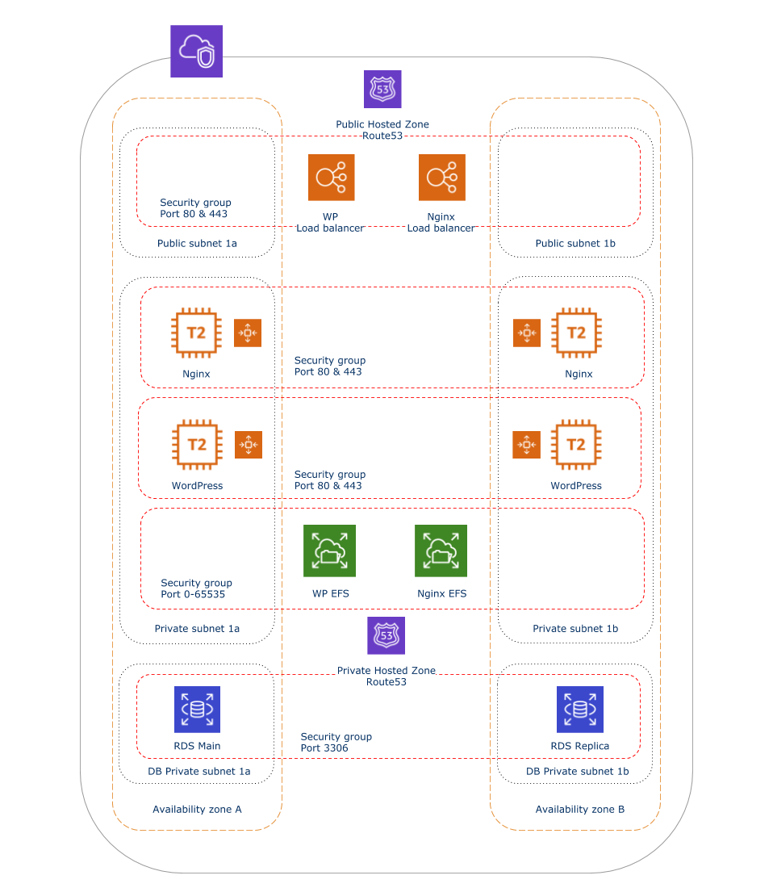

# Website Terraform module

This module comes as three sub modules; 
* WordPress application
* Database (RDS)
* Reverse proxy



## Usage
### Prerequisites
* WordPress prime AMI
* RDS snapshot of database

```hcl-terraform
# WordPress application
module "app" {
    source = "git@github.com:nationalarchives/ds-tf-wp-website//app?ref=main"
    var_one = "foo"
    var_two = "bar"
}
```
```hcl-terraform
# Database
module "rds" {
    source = "git@github.com:nationalarchives/ds-tf-wp-website//rds?ref=main"
    var_one = "foo"
    var_two = "bar"
}
``` 
```hcl-terraform
# Reverse proxy
module "rds" {
    source = "git@github.com:nationalarchives/ds-tf-wp-website//reverse-proxy?ref=main"
    var_one = "foo"
    var_two = "bar"
}
``` 
1. To use a module from this repository, add blocks like the above to your terraform code.
2. Ensure you have all the required inputs (see below).
3. Run `terraform init` to initiate and acquire for each module.
4. First, run `terraform plan` and  `terraform apply` on the app sub module.
5. Then run `terraform plan` and  `terraform apply` on the rds sub module.
6. Finally, run `terraform plan` and  `terraform apply` on the revers proxy sub module.

### WordPress

Name | Description | Example
------------ | ------------- | -------------
environment | Environment | `live`
service | Service name | `website`
owner | Service owner | `Digital Services`
created_by | Created by individual's email | `john.smith@example.com`
cost_centre | Cost centre code | `99`
vpc_id | VPC ID | `vpc-2f09a348`
public_subnet_*_id | Public subnet IDs | `subnet-b46032ec` 
private_subnet_*_id | Private subnet IDs | `subnet-b46032ec`
ami_id | WordPress Primer AMI ID | `ami-0ee25cc86cea3`
instance_type | EC2 instance type | `t2.large`
key_name | Pair key name | `website-wp-key`
wp_domain_name | Service internal domain name | `live.example.gov.uk`
asg_max_size | Autoscaling Group max size | `2`
asg_min_size | Autoscaling Group min size | `4`
asg_desired_capacity | Autoscaling Group desired capacity | `2`
asg_health_check_grace_period | Autoscaling Group health check grace period | `300`
asg_health_check_type | Autoscaling Group health check type | `EC2`
public_ssl_cert_arn | SSL certificate ACM arn | `arn:aws:acm:eu-west-2:*:certificate/*`
efs_mount_dir | EFS mount directory | `/mnt/efs`
wp_db_name | Database name | `websitedb`
wp_db_username | Database user | `websiteuser`
wp_db_password | Database password defined in Secrets Manager | `kj34jh98sdf345`
everyone | CIDR block public access | `0.0.0.0/0`
patch_group_name | Systems Manager automated patch group name | `linux-2-patch-group`

### RDS

Name | Description | Example
------------ | ------------- | -------------
environment | Environment | `live`
service | Service name | `website`
owner | Service owner | `Digital Services`
created_by | Created by individual's email | `john.smith@example.com`
cost_centre | Cost centre code | `99`
vpc_id | VPC ID | `vpc-2f09a348`
wp_app_access_sg_id | App public access Security Group ID (source output) | `sg-903004f8`
route53_local_zone_id | Route 53 private zone ID | `/hostedzone/Z119WBBTVP5WFX`
wp_db_name | Database name | `websitedb`
wp_db_username | Database user | `websiteuser`
wp_db_password | Database password defined in Secrets Manager | `kj34jh98sdf34`
db_instance_class | RDS instance type | `db.t2.medium`
db_engine | RDS engine | `mysql`
db_engine_version | RDS engine version | `8.0.17`
db_allocated_storage | RDS storage | `5`
db_storage_type | RDS storage type | `gp2`
db_storage_encrypted | RDS storage encrypted | `true`
db_license_model | RDS licence model | `general-public-license`
db_snapshot_identifier | RDS snapshot to create RDS from | `website-rds-20201207`
db_apply_immediately | RDS apply immediately | `false`
db_subnet_group_name | VPC DB subnet group name | `subnet-group-db-dev`
db_multi_az | RDS multi AZ | `false`
db_parameter_group_family | RDS parameter group family | `mysql8.0`
db_parameter_group_name | RDS parameter group name | `website-wp-mysql-8`
db_backup_window | RDS backup window | `01:46-02:16`
db_backup_retention_period | RDS backup retention period (days) | `7`
everyone | CIDR block public access | `0.0.0.0/0`

### Reverse proxy

Name | Description | Example
------------ | ------------- | -------------
environment | Environment | `dev`
service | Service name | `website`
owner | Service owner | `Digital Services`
created_by | Created by individual's email | `john.smith@example.com`
cost_centre | Cost centre code | `99`
vpc_id | VPC ID | `vpc-2f09a348`
public_subnet_*_id | Public subnet IDs | `subnet-b46032ec` 
private_subnet_*_id | Private subnet IDs | `subnet-b46032ec`
ami_id | WordPress Primer AMI ID | `ami-0ee25cc86cea3`
instance_type | EC2 instance type | `t2.large`
key_name | Pair key name | `website-wp-key`
int_domain_name | Service internal domain name | `live.example.gov.uk`
public_domain_name | Service public domain name | `www.example.gov.uk`
website_public_lb_dns_name | WordPress app load balancer DNS name (source output) | `website-*.eu-west-2.elb.amazonaws.com`
website_public_lb_zone_id | WordPress app load balancer zone ID (source output) | `Z12O32XQLPTSW3`
asg_max_size | Autoscaling Group max size | `2`
asg_min_size | Autoscaling Group min size | `4`
asg_desired_capacity | Autoscaling Group desired capacity | `2`
asg_health_check_grace_period | Autoscaling Group health check grace period | `300`
asg_health_check_type | Autoscaling Group health check type | `EC2`
public_ssl_cert_arn | SSL certificate ACM arn | `arn:aws:acm:eu-west-2:*:certificate/*`
efs_mount_dir | EFS mount directory | `/mnt/efs`
website_efs_sg_id | WordPress app EFS security group ID (source output) | `sg-4d90f4f2c5f5e4081`
website_public_access_sg_id | WordPress app public security group ID (source output) | `sg-4d90f4f2c5f5e4081`
everyone | CIDR block public access | `0.0.0.0/0`
patch_group_name | Systems Manager automated patch group name | `linux-2-patch-group`
